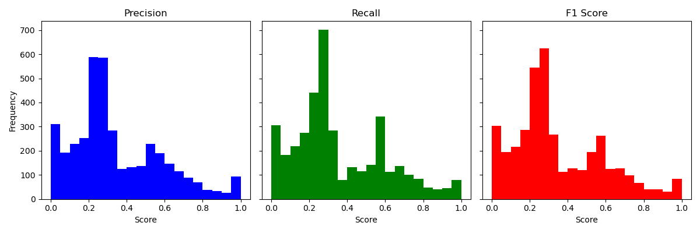
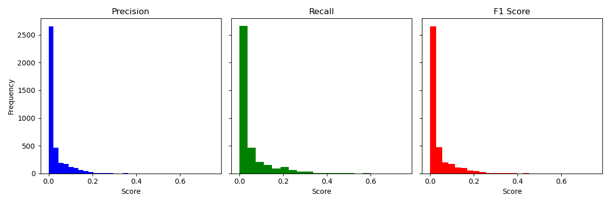
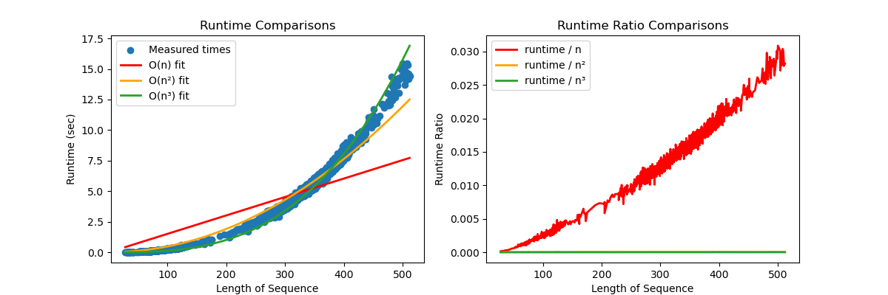

# Zuker Algorithm Implementation for RNA Secondary Structure Prediction

## Running the code
External libraries used:
- numpy==2.1.3
- pandas==2.2.3
- matplotlib==3.10.0

## Architecture
- `lookup.lookup.py`: Handles energy lookup tables for stacking, hairpin, bulge, internal, and multiloop energies. Parses data files and creates JSON caches.
- `lookup.stack.json`, `lookup.bulge.json`, `lookup.hairpin.json`, `lookup.internal.json`: JSON files containing precomputed energy values.
- `algos.zuker.py`: Main implementation of the Zuker algorithm, including DP tables (V, W, WM) and backtracing for structure prediction.
- `algos.nussinov.py`: Minor implementation of the Nussinov algorithm to compare to our implementation of Zuker.
- `validation.py`: Scripts for validating the implementation against known structures and datasets.

## Zuker class details
The Zuker class takes in RNA string $S \in \{G, C, A, U\}^n$ and computes a simplistic Zuker algorithm implementation for RNA secondary structure prediction by minimizing minimum free energy. It also takes optional arguments `min_loop`, `offset`, `helix`, and `unpaired_nuc` representing the minimum loop size, multiloop initiation penalty, multiloop helix/branch penalty, and multiloop unpaired nucleotides penalty respectfully. The class has the following attributes:
- `self.seq`: the original RNA sequence
- `self.n`: length of the RNA sequence
- `self.lookup`: the lookup table used to calculate the free energies of hairpin loops, stacking base pairs, and internal/budge loops
- `self.W`: the resulting W matrix from the algorithm
- `self.V`: the resulting V matrix from the algorithm
- `self.WM`: the resulting WM matrix from the algorithm
- `self.W_pointers`: the resulting W pointers matrix from the algorithm
- `self.V_pointers`: the resulting V pointers matrix from the algorithm
- `self.WM_pointers`: the resulting WM pointers matrix from the algorithm
- `self.pairs`: a list of tuples representing the base pairs of the secondary structure
- `self.m`: minimum loop size
- `self.a`: multiloop initiation penalty
- `self.b`: multiloop helix/branch penalty
- `self.c`: multiloop unpaired nucleotides penalty
- `self.mfe`: calculated minimum free energy for the RNA sequence
- `self.dot`: the dot-parentheses format of the predicted RNA structure.
- `self.runtime`: the total time taken to run the algorithm

## Validation

### Dataset: ArchiveII
- Source: [Hugging Face ArchiveII Dataset](https://huggingface.co/datasets/multimolecule/archiveii)
- Provides RNA sequences and corresponding dot-parentheses notations for comparison.

Validation was performed with the following steps:

1. Call the Zuker algorithm on all sequences in the dataset and retrieve a list of the predicted base pairs (a list of lists representing the indices that paired).

2. Represent the base pairs in the actual solution as a list of the predicted base pairs.

3. Compare the two lists and compute the following metrics:
- **F1 Score:** Harmonic mean of precision and recall.
- **Precision:** Fraction of predicted base pairs that are correct.
- **Recall:** Fraction of true base pairs that are predicted.

## Results
We created histograms representing the precision, recall, and f1-score of our implemented Zuker algorithm:

We created histograms representing the precision, recall, and f1-score of a simplistic Nussenov algorithm:

We created graphs showing that our algorithm runs in $O(n^3)$:

## Citations
- Dataset: [ArchiveII on Hugging Face](https://huggingface.co/datasets/multimolecule/archiveii)
- Lookup table data files: [RNAstructure] (https://rna.urmc.rochester.edu/Overview/index.html)
- Nussinov algorithm: (https://www.pnas.org/doi/epdf/10.1073/pnas.77.11.6309)
- Zuker algorithm: (https://pmc.ncbi.nlm.nih.gov/articles/PMC326673/)